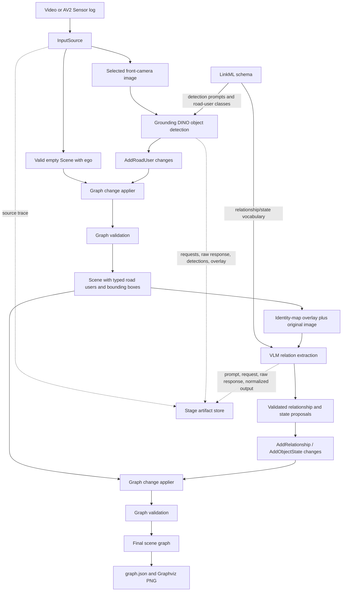
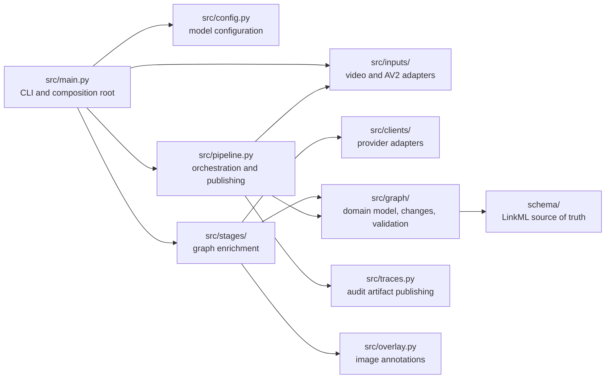

# sgg-vlm

`sgg-vlm` generates a normalized scene graph from one forward-facing driving-camera frame. It currently:

1. loads a frame from a video or an Argoverse 2 (AV2) Sensor log;
2. detects schema-defined road users with Grounding DINO 1.6 Pro;
3. asks a configurable vision-language model (VLM) to extract ego-relative spatial relationships and object states; and
4. validates and publishes the graph together with stage-by-stage audit artifacts.

The pipeline is intentionally single-frame. It does not perform temporal scene-graph generation; the schema only leaves room for an optional cross-frame `track_id` association.

## Requirements

- Python 3.12 or newer
- [uv](https://docs.astral.sh/uv/)
- [Graphviz](https://graphviz.org/) with the `dot` executable on `PATH`
- Network access and credentials for:
  - DeepDataSpace Grounding DINO object detection
  - one VLM platform configured in `models.yaml`

Install the Python environment from the lockfile:

```bash
uv sync
```

## Configuration

The application loads credentials from the environment and from a repository-root `.env` file.

Object detection always requires:

```dotenv
DEEPDATASPACE_TOKEN=...
```

Relation extraction defaults to the `gemini` platform in `models.yaml`, so the default setup also requires:

```dotenv
GEMINI_API_KEY=...
```

The configured alternatives use these credentials:

| Platform | Credential | Optional API-base override |
| --- | --- | --- |
| `gemini` | `GEMINI_API_KEY` | — |
| `qwen` | `DASHSCOPE_API_KEY` | `DASHSCOPE_API_BASE` |
| `kimi` | `MOONSHOT_API_KEY` | `MOONSHOT_API_BASE` |
| `glm` | `ZAI_API_KEY` | `ZAI_API_BASE` |

`models.yaml` controls the default platform, provider model identifiers, timeouts, API bases, and provider-specific LiteLLM parameters. Select another configured platform per invocation with `--relation-platform`:

```bash
uv run python -m src.main video DASH_1080.mp4 \
  --timestamp 52 \
  --relation-platform qwen
```

A different model configuration file can be supplied with `--model-config PATH`.

## Usage

Run `just` to list the common commands. All paths below are relative to the repository root.

### Process a video frame

Place a video in `inputs/videos/`. The CLI accepts a base filename, not an absolute or nested path. `--timestamp` is a non-negative presentation time in seconds; the first frame at or after that time is selected.

```bash
just video DASH_1080.mp4 52
```

Equivalent direct invocation:

```bash
uv run python -m src.main video DASH_1080.mp4 --timestamp 52
```

Select the first frame by omitting the timestamp or using `0`:

```bash
uv run python -m src.main video DASH_1080.mp4
```

### Process an AV2 front-camera frame

The repository includes a downloader for the front-camera subset of AV2 Sensor logs. List available validation logs and their local status:

```bash
just av2-list
```

Download a random log or a specific log:

```bash
just av2-download-random
just av2-download <LOG_ID>
```

Use `split=train` for the training split:

```bash
just av2-download <LOG_ID> train
```

Generate a graph for a zero-based `ring_front_center` frame index:

```bash
just av2 <LOG_ID> 0
```

Equivalent direct invocation:

```bash
uv run python -m src.main av2 <LOG_ID> --split val --frame 0
```

Downloaded data is stored under:

```text
inputs/av2/sensor/<split>/<log-id>/
```

Only `ring_front_center` images and the small set of required AV2 metadata files are downloaded.

### Choose an output directory

Without `--output`, each run receives a UTC timestamp directory under `outputs/`. A custom output root can be supplied to either input command:

```bash
uv run python -m src.main video DASH_1080.mp4 \
  --timestamp 52 \
  --output outputs/my-run
```

Use a fresh output location. The pipeline refuses to overwrite an existing numbered stage directory.

## Outputs

A successful run has this general layout:

```text
outputs/<run-timestamp>/
└── frame_000001/
    ├── 01-input/
    │   ├── graph.json
    │   ├── graph.png
    │   ├── image.png            # extension may match the source image
    │   └── source.json
    ├── 02-object-detection/
    │   ├── graph.json
    │   ├── graph.png
    │   ├── request.json
    │   ├── response.raw.json
    │   ├── detections.json
    │   └── overlay.png
    ├── 03-relation-extraction/
    │   ├── graph.json
    │   ├── graph.png
    │   ├── stage-input.json
    │   ├── prompt.txt
    │   ├── request.json
    │   ├── response.raw.json
    │   ├── response.txt
    │   ├── identity-map.png
    │   ├── relationships.json
    │   └── states.json
    └── graph.json               # final normalized scene graph
```

Every numbered directory is a snapshot after that stage. `graph.json` is the normalized semantic result, while the other files are non-semantic traces for inspection and debugging. `graph.png` is a Graphviz rendering of the corresponding snapshot.

If object detection finds no road users, relation extraction is skipped and records that decision in `request.json`; no VLM request is made.

## Data flow



### Stage behavior

1. **Input**
   - `VideoSource` decodes the first video frame at or after the requested presentation timestamp.
   - `Av2Source` selects a zero-based frame from `ring_front_center`, sorted by timestamp filename.
   - The source creates an empty, valid `Scene` containing the reserved `ego` node and source provenance.

2. **Object detection**
   - Detectable classes and text prompts are discovered from LinkML annotations rather than duplicated in stage code.
   - The current prompts cover cars, trucks, buses, school buses, motorcycles, cyclists, and pedestrians.
   - Grounding DINO returns pixel-space XYXY boxes and source confidence values.
   - Results become controlled `AddRoadUser` changes with stable frame-local IDs such as `road_user_001`.

3. **Relation extraction**
   - The stage sends the VLM both the original frame and an identity-map image containing road-user IDs and boxes.
   - The prompt vocabulary is derived from the schema.
   - The current extractable relationships are `InFrontOf`, `Behind`, `LeftOf`, and `RightOf`. Longitudinal and lateral alternatives are mutually exclusive per road user.
   - The current object state is `StopArmState` (`deployed` or `stowed`), applicable only to `SchoolBus`.
   - Unknown IDs or types, duplicate proposals, conflicting relationships, and invalid state values are rejected before graph mutation.

4. **Apply, validate, and publish**
   - Stages return semantic changes instead of mutating a `Scene` directly.
   - The pipeline applies changes to a deep copy, validates the complete graph, and then atomically publishes the stage directory.
   - A failed stage is logged and does not publish a partial stage directory.

## Scene graph model

The authoritative graph definition is the LinkML schema under `schema/`. The runtime representation is the generated Pydantic model in `src/graph/models.py`.

A final `Scene` contains:

- `frame_id` and optional source `timestamp_ns`;
- scene-level provenance;
- one reserved `EgoVehicle` with ID `ego`;
- detected `road_users`, each with a concrete type, pixel bounding box, optional `track_id`, and provenance;
- optional object `states` referencing road-user IDs; and
- optional spatial `relationships` from a road user to `ego`.

Important invariants include:

- road-user and relationship IDs are unique;
- `ego` cannot be used as a perceived road-user ID;
- bounding boxes have ordered, non-negative coordinates;
- state subjects exist and have a compatible road-user type;
- relationship subjects exist and every relationship targets `ego`; and
- each road user has at most one relationship in each schema-defined exclusive group.

## Software architecture



The main boundaries are expressed as small protocols:

- `InputSource` loads one source-independent `Frame`.
- `ObjectDetectionClient` isolates detector providers.
- `VlmClient` isolates multimodal model providers.
- `Stage` enriches a graph by returning allowed `SceneChange` values and `Trace` artifacts.
- `GraphChangeApplier` owns semantic graph mutation.
- `GraphValidator` owns cross-object domain invariants.
- `TraceStore` owns materialization of non-semantic audit files.

This separation keeps provider transport details out of the graph domain and allows stages or clients to be replaced without changing pipeline orchestration.

## Repository structure

```text
.
├── justfile                    # common data and inference commands
├── models.yaml                 # relation-extraction provider/model settings
├── pyproject.toml              # Python package metadata and dependencies
├── uv.lock                     # reproducible dependency lockfile
├── schema/
│   ├── scene_graph.yaml        # root LinkML Scene schema
│   ├── common.yaml             # geometry and provenance
│   ├── road_users.yaml         # road-user hierarchy and detection prompts
│   ├── relationships.yaml      # ego-relative spatial relationships
│   └── states.yaml             # object states and extraction vocabulary
├── scripts/
│   └── av2_downloader.py       # focused AV2 front-camera downloader
├── src/
│   ├── main.py                 # CLI and dependency composition
│   ├── config.py               # models.yaml parsing and validation
│   ├── frame.py                # image plus current Scene
│   ├── pipeline.py             # ordered execution and atomic stage output
│   ├── stage.py                # Stage protocol and StageOutput
│   ├── traces.py               # trace values and filesystem store
│   ├── overlay.py              # labeled bounding-box rendering
│   ├── inputs/                 # VideoSource and Av2Source
│   ├── clients/                # Grounding DINO and LiteLLM adapters
│   ├── stages/                 # object detection and relation extraction
│   └── graph/                  # models, schema discovery, changes, validation,
│                              # extraction metadata, and Graphviz rendering
├── inputs/                     # local videos and downloaded AV2 subsets
└── outputs/                    # timestamped inference results and traces
```

## Extending the pipeline

The schema is the vocabulary source of truth:

- a concrete `PerceivedRoadUser` with an `object_detection_prompt` annotation becomes an object-detection target;
- a concrete `SpatialRelationship` with `relation_extraction: enabled` becomes part of the VLM relationship vocabulary;
- concrete `ObjectState` classes and their enums define applicable state proposals and accepted values.

After changing the LinkML source, regenerate `src/graph/models.py` before running the application:

```bash
uv run gen-pydantic schema/scene_graph.yaml > /tmp/sgg-vlm-models.py \
  && mv /tmp/sgg-vlm-models.py src/graph/models.py
```

Keep domain validation in `src/graph/validation.py` for constraints that cannot be represented completely in LinkML.

A new enrichment stage should:

1. implement the `Stage` protocol;
2. declare a lowercase hyphenated `name` and its `allowed_changes`;
3. return controlled semantic changes plus optional traces; and
4. be added to the ordered stage tuple in `src/main.py`.

The pipeline will then apply its changes, validate the resulting graph, render it, and publish a numbered stage snapshot.
