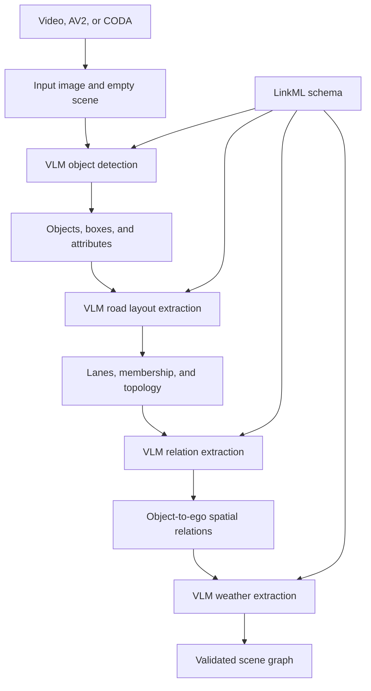

# sgg-vlm

`sgg-vlm` generates a normalized scene graph from one front-camera image.

The application accepts a video frame, an Argoverse 2 Sensor frame, or a CODA image. It processes one frame per run.

The pipeline does not infer across time. The schema reserves `track_id` for an external cross-frame association.

## Pipeline

The pipeline runs five steps in this order:

1. **Input** selects one image and creates a valid scene with the reserved `ego` object.
2. **Object detection** uses a VLM to detect typed objects, pixel boxes, and visible attributes.
3. **Road layout extraction** adds lanes, lane membership, and local lane topology.
4. **Relation extraction** adds longitudinal and lateral relations from visible objects to `ego`.
5. **Weather extraction** sets one visible atmospheric condition or leaves it unset.

Each VLM stage uses a strict JSON response schema. Pydantic and graph validation reject invalid results before stage publication.

A stage writes its output through a temporary directory. A failed stage does not publish a partial stage directory.



## Requirements

- Python 3.12 or newer
- [uv](https://docs.astral.sh/uv/)
- Network access for VLM requests and dataset downloads
- `jj` for the revision in each run name, or `git` as a fallback
- A credential for each platform selected in `models.yaml`

[Graphviz](https://graphviz.org/) is optional. If `dot` is unavailable, the pipeline omits `graph.png` and continues.

## Setup

Install the locked Python environment:

```bash
uv sync
```

Create a repository-root `.env` file with the credential for the current configuration:

```dotenv
DASHSCOPE_API_KEY=...
```

Add this credential if any stage uses Gemini:

```dotenv
GEMINI_API_KEY=...
```

Only configured platforms require credentials. The current configuration uses Qwen for all stages.

## Configuration

`models.yaml` defines shared request limits, stage platforms, model identifiers, API bases, parameters, and model reasoning controls.

The supported platforms are:

| Platform | Model | LiteLLM provider | Credential |
| --- | --- | --- | --- |
| `qwen` | `dashscope/qwen3.8-max` | `dashscope` | `DASHSCOPE_API_KEY` |
| `gemini` | `gemini/gemini-3.5-flash` | `gemini` | `GEMINI_API_KEY` |

Each stage has an independent platform and `reasoning` configuration. The current stage configuration is:

| Stage | Platform | Reasoning mode | Effort |
| --- | --- | --- | --- |
| `detection` | `qwen` | `disabled` | — |
| `road_layout` | `qwen` | `enabled` | `low` |
| `relations` | `qwen` | `enabled` | `low` |
| `weather` | `qwen` | `disabled` | — |

The shared timeout is 120 seconds. The shared output limit is 8192 tokens.

`configs.yaml` defines pipeline behavior outside model transport. It sets `object_detection.min_object_area_ratio` to `0.0003`.

The detector drops a box when its clipped pixel area is below this image-area ratio.

## Usage

List the repository commands:

```bash
just
```

### Video

Place the video in `inputs/videos/`.

Process the first video frame:

```bash
just video DASH_1080.mp4
```

Process the first frame at or after 52 seconds:

```bash
just video DASH_1080.mp4 52
```

Use the direct CLI when necessary:

```bash
uv run python -m src.main video DASH_1080.mp4 --timestamp 52
```

The filename must be a base filename. The timestamp must be non-negative.

### Argoverse 2 Sensor

List validation logs and their local status:

```bash
just av2-list
```

Download a random validation log:

```bash
just av2-download-random
```

Download a specific log:

```bash
just av2-download <LOG_ID>
```

Pass `train` as the final argument to use the training split:

```bash
just av2-download <LOG_ID> train
```

Process a zero-based `ring_front_center` frame index:

```bash
just av2 <LOG_ID> 0
```

Use the direct CLI when necessary:

```bash
uv run python -m src.main av2 <LOG_ID> --split val --frame 0
```

The downloader stores front-camera images and required metadata under this path:

```text
inputs/av2/sensor/<split>/<log-id>/
```

### CODA

Download the official sample subset:

```bash
just coda-download-sample
```

Download the CODA2022 validation subset:

```bash
just coda-download-val
```

Process an image by its annotation ID:

```bash
just coda <IMAGE_ID> sample
just coda <IMAGE_ID> val
```

Use the direct CLI when necessary:

```bash
uv run python -m src.main coda <IMAGE_ID> --subset val
```

The downloader stores each subset under `inputs/coda/<subset>/`.

### Output archive

Move all run directories into `outputs/_archives/`:

```bash
just archive
```

## Outputs

Each run uses this directory name:

```text
outputs/<unix-seconds>-<revision>-<source>-<platforms>/
```

`<platforms>` lists the distinct stage platforms in stage order. A run that uses only Qwen ends with `-qwen`.

A complete run has this structure:

```text
outputs/<run>/
└── frame_000001/
    ├── 01-input/
    │   ├── graph.json
    │   ├── graph.png
    │   ├── image.<image-extension>
    │   └── source.json
    ├── 02-object-detection/
    │   ├── graph.json
    │   ├── graph.png
    │   ├── prompt.txt
    │   ├── stage-input.json
    │   ├── request.json
    │   ├── response.raw.json
    │   ├── response.txt
    │   ├── detections.json
    │   ├── filtered-detections.json
    │   └── overlay.png
    ├── 03-road-layout-extraction/
    │   ├── graph.json
    │   ├── graph.png
    │   ├── prompt.txt
    │   ├── stage-input.json
    │   ├── request.json
    │   ├── response.raw.json
    │   ├── response.txt
    │   ├── identity-map.png
    │   ├── lanes.json
    │   └── relations.json
    ├── 04-relation-extraction/
    │   ├── graph.json
    │   ├── graph.png
    │   ├── prompt.txt
    │   ├── stage-input.json
    │   ├── request.json
    │   ├── response.raw.json
    │   ├── response.txt
    │   ├── identity-map.png
    │   └── relations.json
    ├── 05-weather-extraction/
    │   ├── graph.json
    │   ├── graph.png
    │   ├── prompt.txt
    │   ├── stage-input.json
    │   ├── request.json
    │   ├── response.raw.json
    │   ├── response.txt
    │   └── weather.json
    └── graph.json
```

Every numbered directory contains the validated graph after that stage. The root `graph.json` is the final semantic result.

Trace files preserve prompts, request manifests, raw responses, normalized proposals, and image overlays. Request manifests contain image hashes instead of image data.

If no visible object exists, relation extraction records a skipped request and returns no object-to-ego relations.

## Scene graph model

The LinkML files under `schema/` define the graph. Generated Pydantic models and extraction catalogs reside under `src/graph/_generated/`.

A `Scene` contains:

- one frame identifier and an optional source timestamp
- scene provenance
- zero or one weather value
- a typed object list with exactly one `EgoVehicle` named `ego`
- a typed relation list

Visible objects use pixel-space XYXY boxes. Objects can contain source provenance, an optional `track_id`, and schema-defined attributes.

### Object vocabulary

Object detection currently supports:

- `Car`
- `Truck`
- `Bus`
- `SchoolBus`
- `Motorcycle`
- `Cyclist`
- `Pedestrian`
- `ConstructionWorker`
- `PoliceOfficer`
- `RoadBlockage`

Vehicle types can contain `opening_state` with `open` or `closed`. `SchoolBus` can also contain `stop_arm_position` with `deployed` or `stowed`.

Road layout extraction adds `Lane` objects. Each lane has `direction` set to `same_as_ego`, `opposite_to_ego`, or `crossing`.

### Relation vocabulary

The graph supports these relation groups:

| Group | Relations |
| --- | --- |
| Object to ego | `InFrontOf`, `Behind`, `LeftOf`, `RightOf` |
| Object to lane | `InLane` |
| Lane topology | `LeftAdjacentTo`, `Overlaps` |

`InFrontOf` and `Behind` are mutually exclusive per subject. `LeftOf` and `RightOf` are also mutually exclusive per subject.

Each subject can occupy at most one lane. `Overlaps` uses a canonical endpoint order because it is symmetric.

### Weather vocabulary

The weather value is one of:

- `clear`
- `cloudy`
- `rainy`
- `snowy`
- `foggy`

The value remains absent when the image provides no clear evidence.

### Graph validation

Graph validation enforces these cross-record rules:

- Object and relation IDs are unique.
- Exactly one `EgoVehicle` uses the `ego` ID.
- The `ego` object has no image box.
- Every relation endpoint exists and has the required type.
- Duplicate and conflicting relations are invalid.
- Lane adjacency excludes crossing lanes and repeated direct neighbors.
- Symmetric lane relations use canonical endpoint order.

## Schema compilation

Do not edit files under `src/graph/_generated/` directly.

Edit the LinkML files under `schema/`.

Compile the schema after each schema change:

```bash
just schema
```

The compiler writes these generated files:

- `src/graph/_generated/models.py`
- `src/graph/_generated/catalog.py`

The catalog supplies concrete object types, enum attributes, relation types, exclusive groups, and symmetric relation metadata to the stages.

## Software structure

```text
.
├── configs.yaml                 # Pipeline behavior configuration
├── models.yaml                  # VLM platform and stage configuration
├── justfile                     # Common commands
├── pyproject.toml               # Python metadata and dependencies
├── uv.lock                      # Locked Python environment
├── schema/
│   ├── scene_graph.yaml         # Root Scene schema
│   ├── common.yaml              # Geometry and provenance
│   ├── objects.yaml             # Object hierarchy and attributes
│   ├── relations.yaml           # Spatial and lane relations
│   └── weather.yaml             # Weather vocabulary
├── scripts/
│   ├── av2_downloader.py        # AV2 front-camera downloader
│   ├── coda_downloader.py       # CODA subset downloader
│   └── compile_schema.py        # LinkML compiler
└── src/
    ├── main.py                  # CLI and dependency composition
    ├── config.py                # YAML configuration validation
    ├── pipeline.py              # Stage order and atomic output publication
    ├── stage.py                 # Stage protocol and graph upserts
    ├── traces.py                # Trace values and publication
    ├── clients/                 # VLM protocol and LiteLLM adapter
    ├── inputs/                  # Video, AV2, and CODA sources
    ├── stages/                  # Four graph enrichment stages
    └── graph/                   # Generated models, validation, and Graphviz output
```

`InputSource` converts each supported source into one `Frame`. `Stage` returns object, relation, weather, and trace values through `StageOutput`.

`Pipeline` applies each stage result to a new scene and validates the complete graph. `LiteLlmClient` isolates model transport from graph logic.
